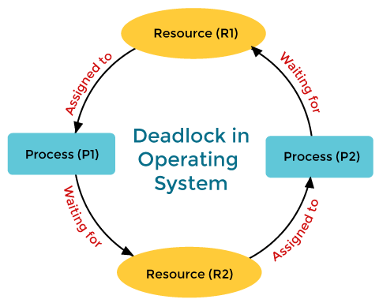
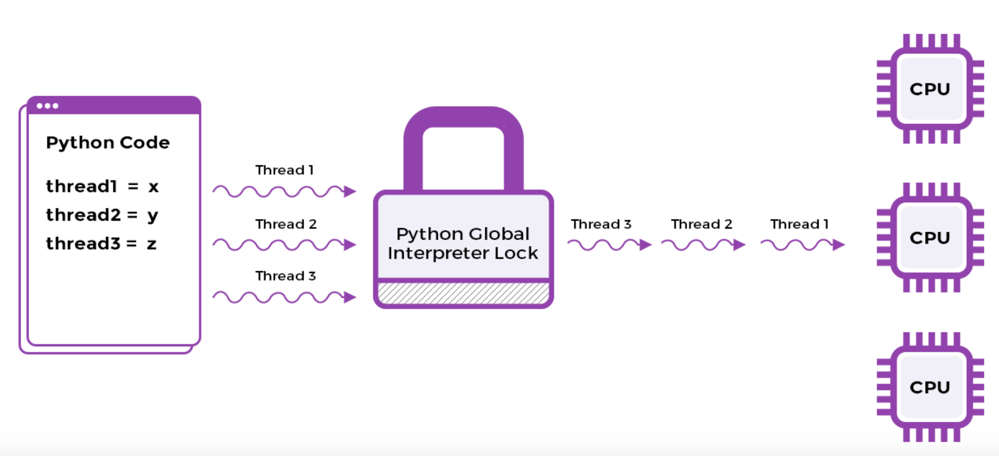

# Python Multithreading

## Basics

### Benefits of Threads
1. **Higher throughput**, though in some pathetic scenarios it is possible to have the overhead of context switching among threads steal away any throughput gains and result in worse performance than a single-threaded scenario. However, such cases are unlikely and are exceptions rather than the norm. Also, multithreaded programs can utilize multiple cores in a machine but a single-threaded program limits itself to a single core even if multiple are available.
2. **Responsive applications** that give the illusion of multitasking on single core machines.
3. **Efficient utilization of resources**. Note that thread creation is lightweight in comparison to spawning a brand new process. Web servers that use threads instead of creating new processes when fielding web requests consume far fewer resources. Moreover, because all threads within a process share the same address space, they need not use shared memory, unlike processes.

### Problems with Threads
1. It's usually very **hard to find bugs**, some that may only rear their heads in production environments. Bugs can't be reproduced consistently and may depend on the sequence in which various threads execute.
2. **Higher cost of code maintenance** since the code inherently becomes harder to reason about.
3. **Increased utilization of system resources**. Creation of each thread consumes additional memory, CPU cycles for book-keeping, and waste of time in context switches.
4. **Programs may experience slowdown** as coordination amongst threads comes at a price. Acquiring and releasing locks adds to program execution time. Threads fighting over acquiring locks cause lock contention.

### Program, Process and Thread
1. A **program** is a set of instructions and associated data that resides on the disk and is loaded by the operating system to perform a task. An executable file or a python script file are examples of programs. In order to run a program, the operating system's kernel is first asked to create a new process, which is an environment in which a program is executed.
2. A **process** is a program in execution. A process is an execution environment that consists of instructions, user-data, and system-data segments, as well as lots of other resources such as CPU, memory, address-space, disk and network I/O acquired at runtime. A program can have several copies of it running at the same time but **a process necessarily belongs to only one program.**
3. A **thread** is the smallest unit of execution in a process which simply executes instructions serially. **A process can have multiple threads running as part of it.** Usually, there would be some state associated with the process that is shared among all the threads and in turn each thread would have some state private to itself. The globally shared state amongst the threads of a process is visible and accessible to all the threads, and special attention needs to be paid when any thread tries to read or write to this global shared state. 

Note:
Processes generally don't share any resources amongst themselves whereas threads of a process can share the resources allocated to that particular process, including memory address space.

Cautious of manipulating shared variables!

Consider the program
```python
counter = 0
def increment(n):
    for i in range(n):
        counter += 1
```
each time the increment is called, the computer executes three instructions:
1. read the value of counter to a CPU register
2. incnrement the value in the resgister by 1
3. store the new value into the place where counter was read

If two threads both calls the increment, then if the CPU does a context swtich after 2, then the counter might be incremented only once. The following code assigns 5 threads each of which computes a increment on the count variable 100000 times. Most of the time it will not behave as expected, i.e. the output will not be 500000

```python
from threading import Thread
import sys

class Counter:

    def __init__(self):
        self.count = 0

    def increment(self):
        for _ in range(100000):
            self.count += 1


if __name__ == "__main__":
    
    # Sets the thread switch interval
    sys.setswitchinterval(0.005)

    numThreads = 5
    threads = [0] * numThreads
    counter = Counter()

    for i in range(0, numThreads):
        threads[i] = Thread(target=counter.increment)

    for i in range(0, numThreads):
        threads[i].start()

    for i in range(0, numThreads):
        threads[i].join()

    if counter.count != 500000:
        print(" count = {0}".format(counter.count,flush=True)
    else:
        print(" count = 50,000 - Try re-running the program")
```

### Concurrency & Parallelism
1. A **concurrent program** is one that can be decomposed into constituent parts and each part can be **executed out of order or in partial order** without affecting the final outcome. A system capable of running several distinct programs or more than one independent unit of the same program in overlapping time intervals is called a concurrent system. The execution of two programs or units of the same program may not happen simultaneously.
2. A **parallel system** is one which necessarily has the ability to execute multiple programs at the same time. Usually, this capability is aided by hardware in the form of **multicore processors on individual machines or as computing clusters where several machines** are hooked up to solve independent pieces of a problem simultaneously. Remember an individual problem has to be concurrent in nature, that is, portions of it can be worked on independently without affecting the final outcome before it can be executed in parallel.

Key take away:
1. a concurrent system need not be parallel, whereas a parallel system is indeed concurrent.
2. Concurrency is about dealing with lots of things at once. Parallelism is about doing lots of things at once.


### Preemptive and Cooperative Multitasking
1. In **preemptive multitasking**, the operating system preempts a program to allow another waiting task to run on the CPU.
2. **Cooperative Multitasking** involves well-behaved programs voluntarily giving up control back to the scheduler so that another program can run.

### Throughput and Letency
1. **Throughput** is defined as the rate of doing work or how much work gets done per unit of time.
2. **Latency** is defined as the time required to complete a task or produce a result. Latency is also referred to as response time

Example:
Consider a a program that is given hundreds of files containing integers and asked to sum up all the numbers. In a single-threaded environment, each file will be sequentially processed, but in a concurrent system, several threads can work in parallel on distinct files.

The throughput in this example can be defined as the number of files processed by the program in a minute. Latency can be defined as the total time taken to completely process all the files.

### Synchronous and Asynchronous 
1. **Synchronous execution** refers to line-by-line execution of code. If a function is invoked, the program execution waits until the function call is completed. Synchronous execution blocks at each method call before proceeding to the next line of code. A program executes in the same sequence as the code in the source code file.
2. **Asynchronous (or async) execution** refers to execution that doesn't block when invoking subroutines. An asynchronous program doesn’t wait for a task to complete before moving on to the next task.

### I/O Bound and CPU Bound
1. Programs which are **compute-intensive**, i.e. where the program execution requires very high utilization of the CPU (close to 100%), are called **CPU bound programs**. Such programs primarily depend upon improving CPU speed to decrease program completion time.
2. **I/O bound programs** spend most of their time **waiting for input or output operations** to complete while the CPU sits idle. I/O operations can consist of operations that write or read from main memory or network interfaces.


### Atomicity
**Atomic operation** is a sequences of instructions that guarantee atomic accesses and updates of shared single word variables so that either all instructions or none are executed. Atomic operation is needed to ensure the thread safty. Locks can help programmers achieve atomicity

### Critical Section & Race Conditions
**Critical section** is any piece of code that has the possibility of being executed concurrently by more than one thread of the application and exposes any shared data or resources used by the application for access.
   
**Race conditions** happen when threads run through critical sections without thread synchronization. The threads "race" through the critical section to write or read shared resources and depending on the order in which threads finish the "race", the program output changes.
   
### Deadlock, Liveness & Reentrant Locks
**Deadlocks** occur when two or more threads aren't able to make any progress because the resource required by the first thread is held by the second and the resource required by the second thread is held by the first.

There are three necessary condition that will lead to a deadlock:
1. **Mutual Exclusion:** The resouces that causes conflict is not shared
2. **Hold and Wait:** They are both holding the resource and waiting for the resource to be released
3. **No Preemption:** Operating system does not preemptively release the lock
4. **Circular Wait:** There must be a circular relationship between at least two threads

Ability of a program or an application to execute in a timely manner is called **liveness**. If a program experiences a deadlock then it's not exhibiting liveness.



A **live-lock** occurs when two threads continuously react in response to the actions by the other thread without making any real progress.

A **ReentrantLock** allows a single thread to enter into the lock on a resource more than once. This is implemented as `Rlock` in `multithreading` module

### `Lock` and `Rlock`

`Lock` can only be acquired once. It cannot be acquired again, until it is released. (After it's been released, it can be re-acaquired by any thread).

An `RLock` on the other hand, can be acquired multiple times, by the same thread. It needs to be released the same number of times in order to be "unlocked".

Another difference is that an acquired Lock can be released by any thread, while an acquired RLock can only be released by the thread which acquired it.

### Mutex and Semaphore
A **mutex** is used to guard shared data such as a linked-list, an array, or any primitive type. A mutex allows only a single thread to access a resource or critical section. Once a thread acquires a mutex, all other threads attempting to acquire the same mutex are blocked until the first thread releases the mutex.

A **Semaphore** is used for limiting access to a collection of resources. Think of semaphore as having a limited number of permits to give out. If a semaphore has given out all the permits it has, then any new thread that comes along requesting a permit will be blocked till an earlier thread with a permit returns it to the semaphore. A **Binary** semaphore is a permit with only 1 aceess.

Difference between muetx and binary semaphore?
* in case of a mutex the same thread must call acquire and subsequent release on the mutex
* in case of a binary semaphore, different threads can call acquire and release on the semaphore.

A mutex is owned by the thread acquiring it till the point the owning-thread releases it, whereas for a semaphore there's no notion of ownership.

### Mutex and Monitor
TO BE CONTINUED

### Mesa and Hoare Monitors
TO BE CONTINUED

### Semaphore vs Monitors
TO BE CONTINUED

### Global Interpreter Lock (GIL)
Why GIL is needed?

* At a higher level when a Python program (.py file) is run, the Python interpreter compiles the source code into byte code (.pyc file if CPython is the interpreter). The generated byte code is a lower-level platform-independent representation that can be understood by the Python Virtual Machine (PVM). In the next step, the byte code is routed to the PVM for execution. PVM isn't a separate component. Rather, it is just a loop in the Python interpreter that is responsible for executing byte code line by line.
* The Python interpreter is responsible for executing a program, but it can only execute a single thread at a time. This is the falling of the reference implementation of Python - CPython. The Python interpreter is only able to run a single thread at a time using a single processor.
* The reason for designing this way is due to python's memory management mechanism. Python manages memory by using a reference counter to each object. When references to an object are removed, the reference count for an object is decremented. When the reference count becomes zero, the object is deallocated. The interpreter executes a single thread in order to ensure that the reference count for objects is safe from race conditions.
* Alternative solution is to create a lock on each object in the prrogram. The problem of this approach is that too many locks can results in deadlocks easily. So GIL is a compromisation made by python

In one line:
The GIL is a single lock on the interpreter itself which adds a rule that execution of any Python bytecode requires acquiring the interpreter lock



## `Threading` Module

### Creating threads
To create a thread, `threading` module needs to be imported
```python
from threading import Thread
t = Thread(group=None, target=None,name=None, args=(), kwargs={}, *, daemon = None)
```
To start a thread, call the `.start()` function
```python
t.start()
```
To wait until a thread terminates, uses `.join()`
```python
t.join()
```
A program will not fully exit if there is still one main thread running. We can set a thread to be daemon, meaning that it will not be counted towards a main thread and will terminate when all threads terminates. To specify a thread is daemon, set argument `daemon=True`

Caveat: if a thread involves mainpualting resources that should be terminated properly, wee should not use a daemon thread. For example, thread that manipualtes database 

### Subclassing Thread
If we want to subclass a thread, we need to write a init function and override the `.run()` method
```python
class MyTask(Thread):
    def __init__(self):
        Thread.__init__(self, name="subclassThread", args=(2, 3))

    def run(self):
        print("{0} is executing".format(current_thread().getName()))
```

### `Lock`
To create a lock, use the `Lock` object
```python
from theading import Lock
l = Lock()
```
lock involves two functionality, `.acquire()` and `.release()`
For a thread to acquire the lock
```python
l.acquire()
```
for a thread to release the lock
```python
l.release()
```
The following 


### `Reentrant Lock`
To create a reentrant lock, which is a lock that is allowed to be aquired by the same thread several times, use the `RLock` object
```python
from theading import Lock
Rl = RLock()
```
Rlock involves two functionality, `.acquire()` and `.release()`
For a thread to acquire the RLock
```python
Rl.acquire()
```
for a thread to release the RLock
```python
Rl.release()
```
note a thread can acquire and release a r lock several times, if and only if before each release, the thread has acquired it at least once, and after the thread terminates, it should have the same amount of release to acquire

### `Timer`
The `Timer` object allows execution of a callable object after a certain amount of time has elapsed. It is a subclass of the `Thread` class
```python
from threading import Timer
t = Timer(interval, function, args=None, kwargs=None)
```
where interval is a floating point representing the time needs to be waited to start the thread and the function is the target function that will be called after the time interval.